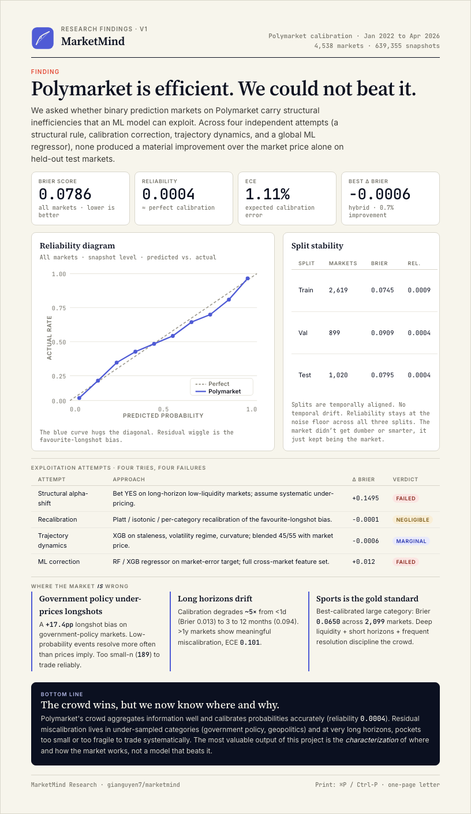

# MarketMind

**Can you beat a prediction market?** We tried four different ways across 4,538 Polymarket markets and 639,807 price snapshots. The answer: no. But we now know exactly where and why the crowd gets it right.

## Deliverables

<!-- Screenshots: run `python scripts/take_screenshots.py` with serve.py running to regenerate -->


| | |
|---|---|
| **[Interactive Dashboard](src/dashboard/index.html)** | Five-page React SPA exploring calibration, bias, exploitation attempts, and data |
| **[Findings One-Pager](src/dashboard/one-pager.html)** | Print-ready single-page research summary (pictured above) |

**Live version:** Once GitHub Pages is enabled, both are available at `https://<username>.github.io/marketmind/`

**View locally:**

```bash
python src/dashboard/serve.py   # serves at http://localhost:8000
# then open:
#   http://localhost:8000/src/dashboard/index.html
#   http://localhost:8000/src/dashboard/one-pager.html
```

## Key Findings

| Finding | Detail |
|---|---|
| Polymarket is efficient | Brier 0.0786, reliability 0.0004 (near-perfect calibration) |
| Four exploitation attempts failed | Structural rule, recalibration, trajectory dynamics, global ML |
| Best model: 0.7% improvement | Hybrid (45% XGB + 55% market price), not enough to be actionable |
| Favourite-longshot bias is real but small | Longshots under-priced by ~5pp, favourites over-priced by ~4pp |
| Government policy is worst-calibrated | +17.4pp longshot bias, but only 43 markets (too fragile to trade) |
| Sports is the gold standard | Brier 0.0650, 2,099 markets, deep liquidity disciplines the crowd |
| Long horizons degrade calibration | ECE goes from 1.4% (<1d) to 10.1% (>1y) |

## Research Question

> Where and when are prediction markets miscalibrated, and can ML models exploit those systematic errors?

We investigated this through four independent approaches:

1. **Structural alpha-shift** on long-horizon low-liquidity markets (+0.1495 Brier, failed)
2. **Calibration correction** via Platt/isotonic recalibration (-0.0001 Brier, negligible)
3. **Trajectory dynamics** using staleness, volatility, curvature (-0.0006 Brier, marginal)
4. **Global ML correction** with cross-market feature set (+0.012 Brier, failed)

**Conclusion:** The crowd aggregates information well and calibrates probabilities accurately. Residual miscalibration lives in under-sampled categories and very long horizons, pockets too small or too fragile to trade systematically.

## Quick Start

```bash
# Setup
python -m venv .venv && source .venv/bin/activate
pip install -r requirements.txt

# Run calibration analysis
python scripts/run_calibration_analysis.py

# Run exploitation experiments
python scripts/run_b5_walkforward.py
python scripts/run_c1_recalibration.py
python scripts/run_c4_trajectory.py

# View results
python src/dashboard/serve.py

# Tests
pytest tests/
```

## Data

**4,538 resolved binary markets** from Polymarket (Jan 2022 to Apr 2026) across 11 categories: sports, politics, crypto, geopolitics, government policy, science/tech, entertainment, social media, economy, fed policy, and more.

**639,807 price snapshots** at 12-hour intervals. This dataset is irreplaceable through current APIs (Polymarket's CLOB v2 migration truncated history to a 31-day window).

## Project Structure

```
src/dashboard/           Interactive dashboard + findings one-pager (React, no build step)
configs/                 YAML configs (data, modeling, experiments)
data/raw/                Raw API responses (5,000 markets, 640K snapshots)
data/processed/          Train/val/test splits (temporal, category-stratified)
src/data/                Fetching, resolution, dataset building
src/features/            Feature engineering (trajectory, cross-market)
src/models/              Model definitions + training
src/evaluation/          Backtesting, calibration, metrics
scripts/                 CLI entry points for each pipeline stage
tests/                   pytest suite
outputs/                 Figures, tables, models
docs/                    Research plans, results summary, data documentation
```

## Evaluation Methodology

- **Brier decomposition**: reliability + resolution + uncertainty
- **Temporal splits only**: train < cutoff < val < cutoff < test (no shuffling, no leakage)
- **Category-stratified**: 60/20/20 within each of 11 categories
- **Calibration curves**: sliced by domain, time horizon, and price bucket
- **Favourite-longshot bias**: per-category and per-horizon analysis
- **Walk-forward validation**: rules frozen on train, evaluated on genuinely future markets

## Related Work

| Study | Contribution | Our addition |
|---|---|---|
| Le (2026) "Decomposing Crowd Wisdom" | Calibration varies by domain | ML exploitation attempts + characterization at scale |
| Reichenbach & Walther (SSRN) | 124M trades analyzed, prices track probabilities | Four independent beating attempts, all failed |
| Page & Clemen (2013) | Favourite-longshot bias at long horizons | Quantified per-category on Polymarket (11 categories) |
| ForecastBench | LLMs vs superforecasters | Market prices vs ML correction (different framing) |
